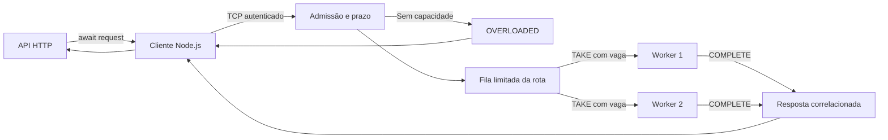

# Arquitetura atual: Nodara v0.3

O [pool de múltiplos brokers](CLUSTER.md) adiciona balanceamento e reconexão no SDK. Cada broker mantém a arquitetura independente descrita abaixo; não há replicação de RPC ou WAL. Os detalhes a seguir documentam a base v0.2, anteriormente chamada VeloBus.

# Arquitetura

VeloBus v0.2 é um intermediário experimental de **request/reply entre APIs e microsserviços**, em um único nó. O núcleo Rust controla admissão, filas e atribuição de chamadas. O cliente TypeScript é um pacote Node.js comum, com ESM, CommonJS e tipos, sem addon nativo. O servidor é um processo separado.

O chamador aguarda com `await`, enquanto a rede usa I/O assíncrona. Uma resposta pendente não deve bloquear o event loop Node nem impedir outras operações na conexão. Isso não paraleliza automaticamente trabalho de CPU dentro de um handler; a aplicação continua responsável por esse trabalho.

## Caminho de uma chamada

Cada chamada é entregue a no máximo um worker. Vários workers podem atender a mesma rota; não recebem cópias da mesma chamada. `REGISTER`, `REQUEST`, `TAKE` e `COMPLETE` usam o envelope binário existente. Veja [RPC-PROTOCOL.md](RPC-PROTOCOL.md).

## Admissão e execução

`REGISTER` associa uma conexão autenticada a uma rota e declara sua concorrência. A soma das capacidades dos workers define quantas chamadas a rota pode executar enquanto eles permanecem conectados. Os workers concordam com um limite para a fila compartilhada de espera.

O broker também limita globalmente quantidade e bytes de chamadas em espera ou execução. Falta de capacidade produz erro rápido; não cria uma fila ilimitada em outra camada. Cada conexão multiplexa um número limitado de operações e correlaciona respostas por ID, inclusive fora de ordem.

O worker pede trabalho por `TAKE` e recebe uma chamada quando tem vaga. O SDK usa uma conexão filha dedicada e loops limitados pela concorrência declarada. `COMPLETE` libera a vaga e entrega sucesso ou erro ao chamador que ainda aguarda. Operações bloqueantes do WAL de eventos ficam fora do agendador RPC.

## Prazo e limpeza

O prazo começa na admissão e inclui fila e execução. Expirar antes da atribuição remove o pedido sem executá-lo. Expirar depois responde `DEADLINE_EXCEEDED`, mas mantém a vaga do worker até `COMPLETE` ou desconexão. Liberar apenas pelo relógio permitiria iniciar mais trabalho sobre um handler ainda ativo.

O SDK fornece `signal` e `remainingMs`. O cancelamento é cooperativo: não interrompe à força uma consulta ou um efeito externo. O SDK deve completar o protocolo mesmo quando o resultado chega tarde. Fechar um `ServiceHandle` interrompe novas tomadas, fecha a conexão e sinaliza handlers ativos, sem aguardar indefinidamente código que não coopera.

A desistência do solicitante remove trabalho em espera. Trabalho iniciado permanece contabilizado até conclusão ou perda do worker. Desconectar um worker falha chamadas ativas sem reenviá-las; perder o último worker também remove a rota e falha sua fila. Desconectar não prova que a execução remota foi interrompida.

## Garantias

Uma resposta RPC bem-sucedida contém o resultado do handler. O broker não confirma transações no banco da aplicação, não persiste o pedido e não promete execução exatamente uma vez. Timeout ou falha de conexão pode deixar o resultado de efeitos externos desconhecido. Repetição é uma decisão explícita da aplicação, normalmente acompanhada de idempotência.

RPC é volátil mesmo quando o WAL de eventos está habilitado. Reiniciar o nó interrompe chamadas; não há replay automático, replicação ou alta disponibilidade. Adicionar workers expande a capacidade dos serviços, mas não elimina o nó único do broker.

## Histórico complementar de eventos

`PUBLISH` e `FETCH` permanecem compatíveis com [PROTOCOL.md](PROTOCOL.md). O histórico limitado em memória pode usar WAL local com checksum e bloqueio exclusivo. O ACK persistente vem após sincronização e confirma armazenamento local, não processamento. Escritas com resultado incerto impedem novas escritas até recuperação.

`all` entrega cada ocorrência correspondente. `latest` combina a mesma combinação `(topic, key)` na janela limitada de busca; chaves vazias não combinam. Preserva o histórico e exige aceitar a omissão de estados intermediários. Nunca se aplica a RPC.

Consumidores salvam `fetch().cursor` após processar todo o lote. Não há geração de histórico, consumidores duráveis, retenção automática ou compactação física nesta versão.

## Limites do desenho

Rust permite controlar alocações, mas a linguagem não demonstra maior velocidade. Raspberry Pi 5 é um alvo de perfilamento, ainda sem resultados nesse hardware. Os orçamentos internos não limitam todo o RSS: conexões, buffers e runtime consomem memória adicional.

O padrão é loopback; acesso remoto exige token e transporte protegido externamente. Não há TLS embutido, proxy HTTP transparente, rate limit, circuit breaker ou escalonamento automático. A evolução proposta está em [ROADMAP.md](ROADMAP.md).
